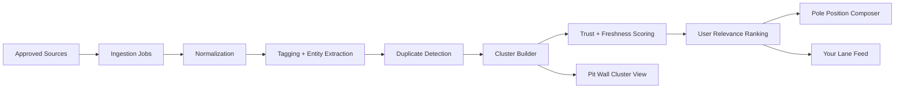

# Oversteer App Architecture

## Architecture Goal

Build a trusted, swipe-first car-news product that combines:

- the clarity of Google News topic control
- the editorial entry point of Apple News
- the passion lanes of Flipboard
- the noise filtering of Feedly and Inoreader

without copying any of their visual design.

## Experience Architecture

### Primary Surfaces

1. Pole Position
The daily editorial lead. A short set of the most important trusted stories, lightly personalized.

2. Your Lane
The main vertical feed ranked by interest graph, source quality, freshness, and interaction history.

3. Pit Wall
Cluster views for major stories where multiple sources cover the same event.

4. Explore
Search, discover brands, teams, topics, eras, and source bundles.

5. Garage
Saved stories, followed topics, watchlists, muted items, and source controls.

6. Alerts
Optional notifications for launches, motorsport results, brand follows, and watchlists.

7. Settings
Privacy, ranking controls, language, notification cadence, and source style.

## Information Architecture

### Top-Level Routes

```text
/
  pole-position
  lane
  pit-wall/[clusterId]
  story/[id]
  explore
  garage
  alerts
  settings
  onboarding
```

### Navigation Model

- home defaults to Pole Position for first open of the day
- users can jump into Your Lane for pure personalized browsing
- every major story can expand into Pit Wall
- Garage acts as the personal control center

## Domain Architecture

### Core Domains

1. Identity
- auth
- onboarding completion
- device preferences

2. Preference Graph
- followed brands
- followed teams and series
- eras and niches
- regions and languages
- source preferences
- muted topics and hidden sources

3. Source Catalog
- approved publishers
- official manufacturer newsrooms
- motorsport organizations
- source trust tier
- source tags and specialties

4. Content Ingestion
- feed ingestion
- normalization
- deduplication
- tagging
- summarization pipeline later

5. Ranking
- trust score
- freshness score
- topic match score
- follow bonus
- repeat-source dampening
- rumor cooling

6. Story Graph
- canonical story
- related articles
- coverage cluster
- primary tags
- related models and brands

7. User Actions
- save
- hide
- less like this
- follow
- mute
- open source
- share

8. Notifications
- topic alerts
- digest scheduling
- race weekend bundles

9. Analytics And Quality
- retention
- save rate
- cluster open rate
- mute rate
- source diversity
- duplicate suppression quality

## Technical Architecture

### Frontend

Recommended stack:

- Next.js App Router
- TypeScript
- server components for initial feed fetch
- client components for interactions and feed tuning
- mobile-first CSS with a strong visual system

### Backend

Recommended stack:

- Supabase Postgres for users, preferences, articles, and actions
- route handlers or server actions for user mutations
- scheduled worker for ingestion and enrichment
- queue-backed processing for tag extraction and clustering if scale grows

### Search And Discovery

MVP:

- Postgres full-text search

Later:

- dedicated search index for topics, models, and source discovery

## Content Pipeline



### Pipeline Steps

1. Pull new items from approved sources.
2. Normalize canonical URL, timestamps, media, source ID, and body summary.
3. Extract entities like brand, model, era, event, region, and motorsport series.
4. Detect duplicate or near-duplicate coverage.
5. Build or update a story cluster.
6. Score source trust and freshness.
7. Personalize for each user at request time or precompute for active users.

## Ranking Architecture

### Two-Layer Feed System

Layer 1:
Global story quality

- source trust
- freshness
- cluster importance
- editorial boosts for major stories

Layer 2:
User relevance

- explicit follows
- topic matches
- prior saves and opens
- hidden or muted penalties
- regional preference

### Ranking Modes

- Balanced
- Fresh first
- Deep cuts
- Motorsport weekend
- Collector mode

These should be user-facing choices, not hidden experiments.

## Database Architecture

### Key Tables

- users
- profiles
- user_interest_topics
- user_source_preferences
- user_story_actions
- user_watchlists
- sources
- source_groups
- source_trust_scores
- articles
- article_entities
- article_clusters
- cluster_articles
- cluster_summaries
- daily_editions
- notifications

### Important Relationships

- one source has many articles
- one article belongs to zero or one active cluster
- one user has many follows, mutes, saves, and hides
- one cluster can have many related articles

## API Architecture

### Read APIs

- `GET /api/feed/pole-position`
- `GET /api/feed/lane`
- `GET /api/clusters/:id`
- `GET /api/story/:id`
- `GET /api/explore`
- `GET /api/garage`

### Write APIs

- `POST /api/onboarding`
- `POST /api/actions/save`
- `POST /api/actions/hide`
- `POST /api/actions/follow`
- `POST /api/actions/mute`
- `POST /api/settings/notifications`

## Client Architecture

### Feature Modules

```text
features/
  feed/
  pole-position/
  pit-wall/
  story/
  onboarding/
  explore/
  garage/
  alerts/
  settings/
services/
  ingestion/
  ranking/
  clustering/
  personalization/
  notifications/
  analytics/
shared/
  ui/
  config/
  types/
  utils/
```

### State Boundaries

Local UI state:

- current card
- card interaction affordances
- sheet open or close state

Server or persisted state:

- onboarding profile
- followed topics
- saved stories
- source preferences
- feed composition inputs

## Trust And Safety Architecture

- whitelist sources manually
- store canonical source metadata
- label source and publish time clearly
- link to originals rather than pretending to replace them
- flag AI-generated summaries as summaries
- keep a report-concern path for bad tags or poor recommendations

## Privacy Architecture

- default to account-light usage when possible
- do not require social graph or contact uploads
- use interaction history only for feed quality
- expose an explanation for why a story appears
- let users clear history, saved items, and topic profile

## Visual Architecture

See [docs/visual-system.md](/C:/Users/HP/Documents/New%20project/oversteer-news-app/docs/visual-system.md).

In short:

- editorial meets cockpit
- magazine polish with garage grit
- warm metallic accents instead of default tech palettes

## Launch Architecture

### Phase 1

- onboarding
- Pole Position
- Your Lane
- story detail
- save, hide, follow

### Phase 2

- Pit Wall clusters
- Garage controls
- source tuning
- notifications

### Phase 3

- advanced search and watchlists
- multilingual summaries
- creator and video bundles
- premium layers if retention earns it
